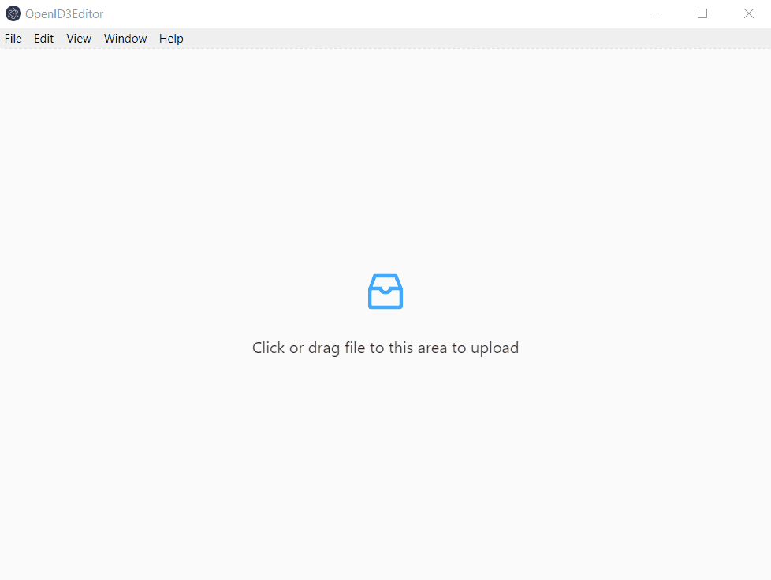

# Open ID3 Tag Editor

<p align="center">
Minimalistic app to edit ID3 (MP3 metadata) tags.
</br>
</br>

<a href="https://opensource.org/licenses/MIT">
  
</a>
<a href="https://travis-ci.com/Bartosz-D3V/open-id3-editor">
  
</a>
<a href="https://codecov.io/gh/Bartosz-D3V/open-id3-editor">
  
</a>
<a href="https://github.com/prettier/prettier">
  
</a>
<a href="https://egghead.io/courses/how-to-contribute-to-an-open-source-project-on-github">
  
</a>
</br>
</br>


</p>

## About

The following application allows to read & write ID3 tags (v1.0, v1.1, v2.3).
The write/read ID3 algorithms have been written from scratch, but the application itself utilises React & Redux libraries
running on top on Electron.

## Install

```bash
yarn // or...
npm install
```

## Run

```bash
yarn start // or...
npm start
```

## Test

```bash
yarn test // or...
npm test
```

## Lint

```bash
yarn lint // or...
npm run lint
```
